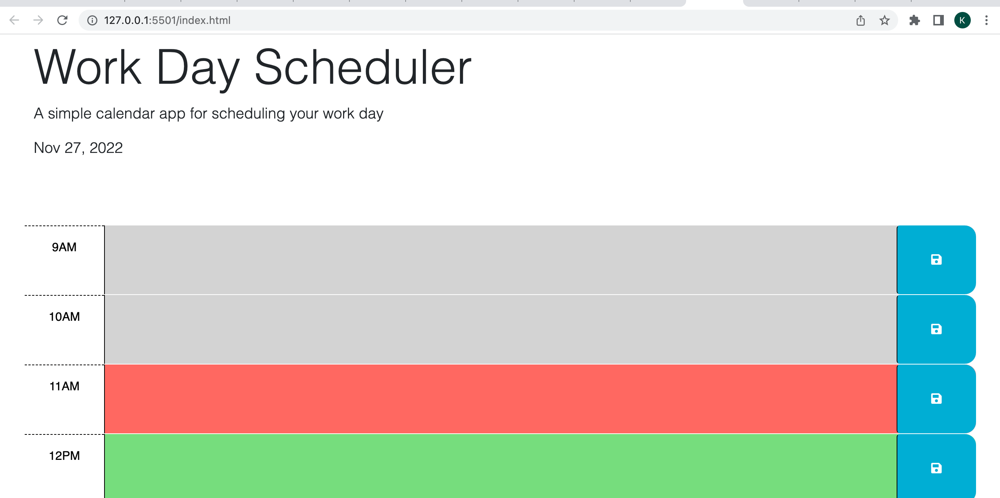

# Work Day Scheduler Challenge, Module 5

Time management daily planner tool

## Description
This is a bootcamp design challenge that has provided starter and example code from which I based this code to create a Work Day Scheduler. The user story prompted the creation of webage scheduler that includes: current date on the page, timeblocks for working hours, text input, and save buttons. The criteria of the project included creating functionality of entering text within time blocks, ability to save data via local storage and display when page is refreshed. The code used APIs including jQuery and Bootstrap. 

## Mockup

## Page Link
https://kristinbrewer.github.io/work-day-scheduler/

## Installation
N/a

## Usage
To practice generating HTML code, JavaScript code, CSS code and web APIs. 

## Credits

N/A

## License 

Please refer to the Licesnse in the repo. 

